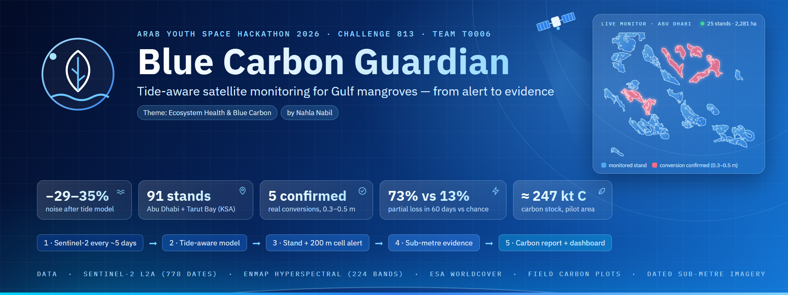
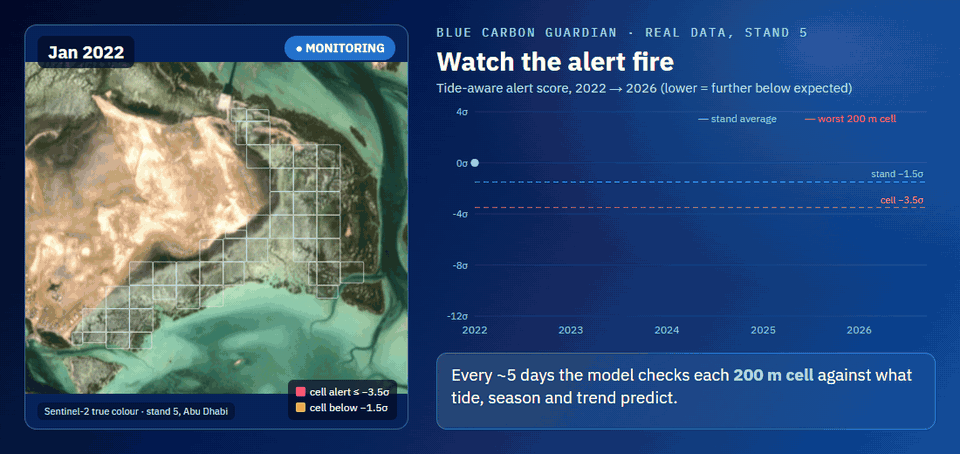
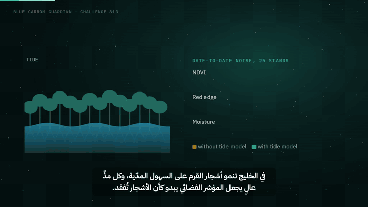
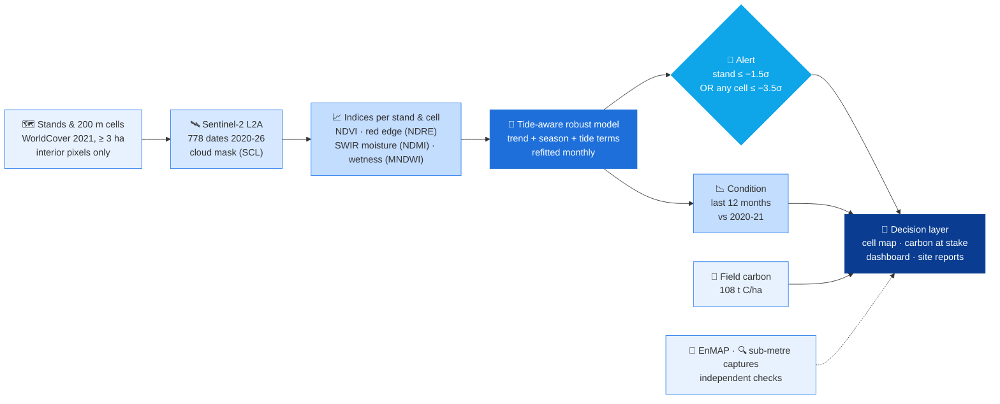
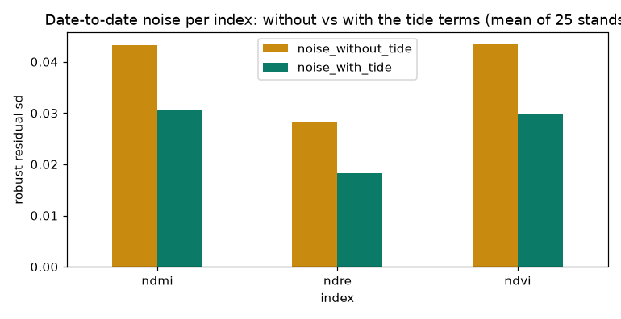
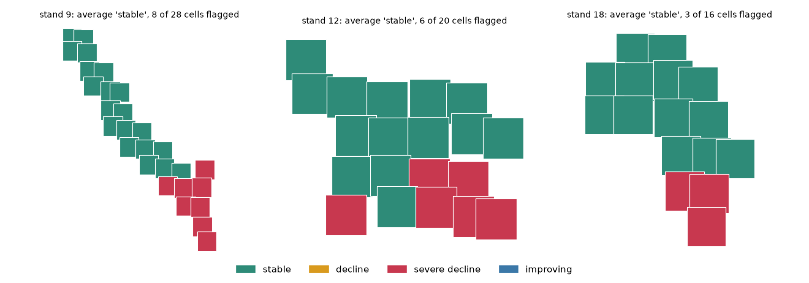
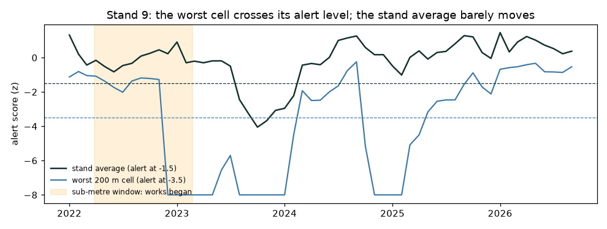
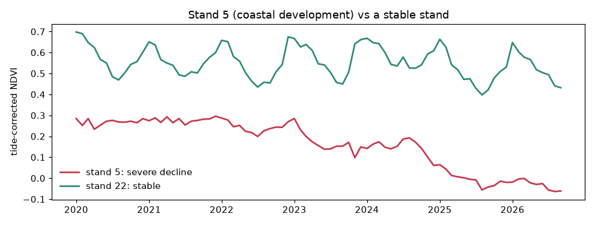
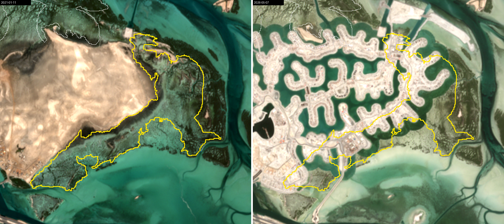
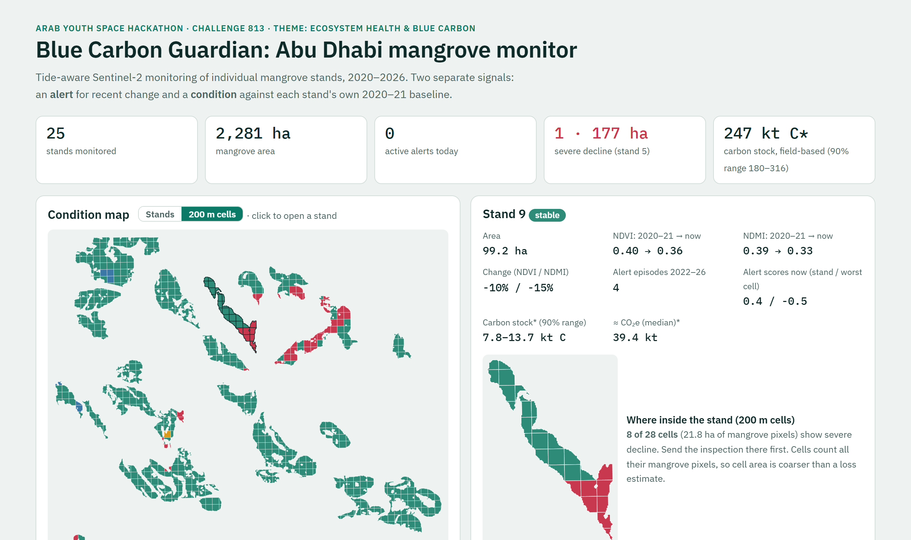

<p align="center"></p>

<p align="center">
  
  
</p>
<p align="center">
  
  
  
  
  
  
</p>

<p align="center"><b>Team T0006 · Nahla Nabil · Country representation: Palestine</b></p>

> **We watch Gulf mangroves from space, stand by stand and in 200 m cells.** The system flags losses with a calibrated false-alarm rate, shows where
> inside a stand to inspect, and reports the carbon at stake. It runs on free Sentinel-2 imagery with a tide model, and it is checked against EnMAP
> hyperspectral data and dated sub-metre imagery.

<h3 align="center">⚡ Watch a real mangrove loss trigger the alert</h3>
<p align="center"><br>
<sub>Real data, stand 5 (Abu Dhabi), 2022 → 2026: Sentinel-2 images, 200 m cells coloured by their alert state, and the tide-aware alert score.
The alert began between the last sub-metre capture showing intact mangrove (Mar 2022) and the first showing works (Feb 2023).
Contains modified Copernicus Sentinel data 2021–2026. Built by <code>scripts/alert_story_data.py</code> + <code>scripts/make_alert_story.py</code>.</sub></p>

<table align="center">
<tr><td align="center"><b>−29 to −35 %</b><br><sub>noise after the tide model</sub></td>
<td align="center"><b>5</b><br><sub>real conversions confirmed at sub-metre</sub></td>
<td align="center"><b>3 of 5</b><br><sub>seen only by 200 m cells</sub></td>
<td align="center"><b>73 % vs 13 %</b><br><sub>partial loss caught in 60 days vs chance</sub></td>
<td align="center"><b>0.79</b><br><sub>false alarms / stand-year on 65 unseen stands</sub></td>
<td align="center"><b>≈ 247 kt C</b><br><sub>carbon stock, pilot area</sub></td></tr>
</table>

<p align="center"><a href="docs/demo_video.mp4"></a><br>
<sub>▶ <a href="docs/demo_video.mp4"><b>Watch the 2:14 demo video</b></a> (English narration, Arabic subtitles) · <a href="docs/slides.pdf"><b>Slides (PDF)</b></a> ·
<a href="notebooks/01_blue_carbon_guardian.ipynb"><b>Main notebook</b></a> · <a href="dashboard/index.html"><b>Dashboard</b></a> (download and open)</sub></p>


---

## 1. Business use case
| 👤 User | 🎯 Decision | 🕰️ What they use today |
|---|---|---|
| **Environment agencies** (Environment Agency Abu Dhabi, MOCCAE; Saudi Arabia's NCVC) | Which stands to inspect this month? Is a protected stand intact? | Periodic field surveys, one-off studies |
| **Planting programmes and carbon-project developers** (for example ADNOC, Red Sea Global) | Is the carbon stock we report still there? Evidence for verification. | Field plots and drone surveys, campaign by campaign |
| **Coastal developers, environmental-impact consultants, regulators** | Did construction stay outside the mangrove line? | Comparing two dated images by eye |

**Offer (hypotheses for a pilot):**
- **Monitor**, USD 12k per site per year: alert, cell map, condition, carbon, monthly site reports.
- **Evidence**, USD 25k: adds a high-resolution check of every alert and an audit pack.
- **Development watch**, USD 8k per construction project.

The measured cost to serve is about USD 3.3k per site per year. Satellites and compute are nearly free; the cost is analyst time and high-resolution
images bought only when an alert fires. Full plan with 13 sources: [`docs/business_plan_draft.md`](docs/business_plan_draft.md).

## 2. The problem
- 🌱 **The UAE and Saudi Arabia each pledge 100 million mangroves by 2030.** Abu Dhabi published the Gulf's first mangrove monitoring guide in February 2026,
  yet the latest regional review calls Gulf monitoring "uneven" (Frontiers in Marine Science, 2025).
- 🏗️ **The stands are small, scattered and next to fast coastal development.** The Gulf has about 165 km² of mangrove, 55-60 km² of it in Abu Dhabi.
- 🛰️ **Why satellites:** free 5-day Sentinel-2 revisits cover every stand since 2015. Nobody can survey every stand every month on foot.
- 🌊 **Why it is hard:** on Gulf tidal flats the **tide**, not the trees, drives most of the change in a satellite index (r about -0.9 with a wetness signal).
  A naive monitor raises false alarms at every high tide.

## 3. Data used
| Dataset | Provider | Dates | Level | Used for | Licence |
|---|---|---|---|---|---|
| 🛰️ **Sentinel-2 MSI** | ESA / Copernicus, via Microsoft Planetary Computer STAC | 2020-01-01 to 2026-09-19 · 778 dates · tiles 40RBN, 39RUK | L2A surface reflectance | all time series | free and open: "Contains modified Copernicus Sentinel data 2020-2026" |
| 🗺️ **WorldCover v200** | ESA | 2021 | 10 m land cover, class 95 (mangroves) | stand outlines | CC BY 4.0, doi 10.5281/zenodo.7254221 |
| 🌈 **EnMAP** (224 bands, 420-2450 nm, 30 m) | DLR | 1 Nov 2022 · 14 Apr 2025 | L2A land | independent check; what the land became | EnMAP licence v1.1: "Contains modified EnMAP data © DLR 2022, 2025". Raw scenes are **not** redistributed |
| 🌳 **Field carbon plots** | Schile et al. 2016, Dryad doi 10.15146/R3K59Z | 2013-2014 | plot data | carbon density | CC0 |
| 🔍 **World Imagery Wayback** (Maxar WorldView-2/3, Legion-1, 0.31-0.5 m) | Esri | captures 2021-2025 | basemap | confirming the conversions (viewed only, nothing stored) | Esri, Maxar, Earthstar Geographics, and the GIS User Community |

Satellite 813 data were not available during the PoC (per the onboarding guide); the method is ready for them at incubation.

## 4. Technical approach

1. **Stands and cells.** ESA WorldCover 2021 mangrove patches of at least 3 ha become stands: 25 pilot stands (2,281 ha) and 65 unseen test stands in Abu
   Dhabi and Saudi Arabia's Tarut Bay. Each stand is cut into 200 m cells.
2. **Series.** For every clean Sentinel-2 date, the median of each index over each stand's and cell's interior pixels, plus the flooded fraction.
3. **Tide-aware model.** A robust (Huber) regression of each index on trend + 2 seasonal harmonics + **tide terms** (MNDWI, MNDWI², flooded fraction),
   refitted every month on the window [t - 36 months, t - 3 months].
4. **Alert.** z = (observed - expected) / robust sigma, averaged over the three indices; the state is the median of the last 5. **Stand state ≤ -1.5 OR any cell
   state ≤ -3.5.** Both thresholds were calibrated together to about 1 false-alarm episode per stand-year.
5. **Condition.** Tide-corrected index over the last 12 months against the 2020-21 median: severe decline, decline, stable or improving.
6. **Carbon.** Area x field density, 108 t C/ha (90 % CI of the mean 79-138): a **stock** with a range, never a sequestration rate.
7. **Checks:**
   - simulated losses with a chance baseline;
   - 65 out-of-sample stands;
   - EnMAP on the same dates;
   - dated sub-metre captures of every converted site.

Code: [`src/bcg/monitor.py`](src/bcg/monitor.py) (core) and [`analysis/`](analysis/) (34 numbered scripts with a summary per result; index in
[`analysis/README.md`](analysis/README.md)).

## 5. Installation
Requires **Python 3.12** (tested on 3.12.10). No GPU, no credentials, no API keys.
```bash
git clone https://github.com/Nahla-Nabil/blue-carbon-guardian.git
cd blue-carbon-guardian
python -m venv .venv
.venv\Scripts\activate            # Windows
# source .venv/bin/activate       # Linux / macOS
pip install -r requirements.txt
```

## 6. How to run
```bash
jupyter lab notebooks/01_blue_carbon_guardian.ipynb
```
Run all cells; nothing needs editing. **Runtime is about 25 seconds on a laptop, offline.** We tested it in a fresh environment built from
`requirements.txt`, with 0 errors.
- **Reads** [`data/sample_input/`](data/sample_input/): real Sentinel-2 series of the 25 pilot stands and the 64 cells of stands 9, 12 and 18.
- **Writes** six figures and tables to [`results/`](results/).
- **Ends with** the headline numbers and their limits.

Full pipeline from the satellite archive (needs internet; about 20-60 min per Sentinel-2 step): see the rebuild order in
[`analysis/README.md`](analysis/README.md). The EnMAP steps need your own free DLR licence.

## 7. Example input and output
**Input:** [`data/sample_input/`](data/sample_input/) (3.7 MB). Its README lists the exact STAC collection, tile, dates and processing.

| 🌊 Tide correction cuts the noise by about a third | 🧩 Stand averages hide partial loss; 200 m cells do not |
|---|---|
|  |  |
| 🚨 **Stand 9:** the worst cell crosses its alert level while the stand average barely moves | 📉 **Stand 5** (coastal development) against a stable stand |
|  |  |

<p align="center"><br>
<sub>Stand 5 on Sentinel-2 true colour, 2021 → 2026: a coastal reclamation takes part of the mangrove stand (yellow outline).</sub></p>

<p align="center"><br>
<sub>The product: <code>dashboard/index.html</code> (one self-contained file). Condition map in 200 m cells; stand panel with where to inspect; carbon at stake.</sub></p>

## 8. Results and limitations
| What we measured | Result | How it was validated |
|---|---|---|
| Noise reduction from the tide model | **29-35 %** on every index | robust residuals, 25 stands, 2020-2026 |
| Real conversions inside our stands | **5** (stands 5, 9, 12, 18, 6), all coastal developments | dated WorldView-2/3 and Legion-1 captures (0.3-0.5 m); the alert began between the last undisturbed and the first disturbed capture at every site |
| Found only by the 200 m cells | **3 of 5** | the stand averages still read "stable" |
| Partial loss (a tenth of a stand losing half its canopy) caught within 60 days | **73 %**, against **13 %** by chance | semi-synthetic backtest with a no-loss null ([`analysis/29`](analysis/29_cell_trigger.md)) |
| Uniform 10 % loss caught within 6 months | **63 %**, against 36 % by chance | same |
| False alarms on unseen stands (thresholds fixed) | **0.79** per stand-year, against 0.96 calibrated | 65 stands, 305 stand-years, including Saudi Arabia ([`analysis/33`](analysis/33_scaleout_union_summary.md)) |
| EnMAP hyperspectral against Sentinel-2 | **r = 0.84-0.99** | same-date stand comparisons |
| Stand 5 loss | **26-62 ha** | two independent methods (Sentinel-2 change indicator, EnMAP pixels) |
| Carbon stock, pilot area | **≈ 247 kt C** (180-316) | 24 field plots near the stands |

**⚠️ Limits, stated honestly:**
- The alert is detection of works as they happen, **not advance warning**.
- Patches under about 0.6 ha and young plantings are not seen at 10 m.
- Outlines come from a 2021 land-cover map; extent accuracy is modest (F1 about 0.6).
- The confirmations use dated imagery, not site visits or permit records.
- Simulated losses are canopy-cover losses, not leaf stress.
- EnMAP did **not** beat multispectral as a classifier (F1 0.74 against 0.72).
- Carbon density comes from 4 nearby sites (2013-14).
- Reference labels are AI-assisted photo-interpretation.
- We **withdrew** our own first backtest figure (58 % / 90 %) when a null test showed that its metric counted alerts that were already running.

## 9. Author, tools, licence and attribution
**👩‍💻 Author: Nahla Nabil** (Bahrain), Team T0006. Idea, satellite data pipeline, tide-aware model, validation, dashboard and business case.

| 🧰 Tools | Used for |
|---|---|
| Python 3.12 · NumPy · pandas · SciPy · scikit-learn | modelling, statistics, validation |
| rasterio · shapely · pystac-client · planetary-computer | reading Sentinel-2 / WorldCover / EnMAP straight from the cloud (STAC, COG) |
| Matplotlib · Jupyter | figures, notebook |
| HTML + SVG + JavaScript | self-contained dashboard and site reports |
| Playwright · FFmpeg · edge-tts | slide export, demo video (generated narration and music) |
| Claude (Anthropic), an AI coding assistant | assisted development. All results are reproducible from this repository |

**Licence:** code under the MIT licence ([`LICENSE`](LICENSE)). Data keep their own licences (section 3).

**Built on:**
- the official 813 Challenge starter notebooks and data guidance;
- ESA / Copernicus Sentinel-2 via Microsoft Planetary Computer;
- ESA WorldCover;
- DLR EnMAP;
- Schile et al. 2016;
- Esri World Imagery Wayback.

<details><summary><b>📁 Repository layout</b></summary>

```
README.md  LICENSE  requirements.txt
notebooks/01_blue_carbon_guardian.ipynb   main analysis, runs end to end on the sample (outputs committed)
data/sample_input/                        example input (real Sentinel-2 series) + how it was produced
results/                                  example output written by the notebook
src/bcg/monitor.py                        core model (tide-aware monitor, condition, alert rule)
analysis/                                 full pipeline: 34 numbered scripts, a summary .md per result, data/ tables, figures/
dashboard/index.html                      product demo (self-contained)
reports/                                  automatic per-stand site reports
docs/                                     slides.pdf, demo_video.mp4, business plan, API and alert concept, README assets
deck_source/                              slide sources
video/                                    demo-video sources (narration EN + AR, motion graphics, renderer)
scripts/                                  sample-input and notebook builders, slide export, README visuals (banner, alert story), EnMAP download helper
```
</details>
